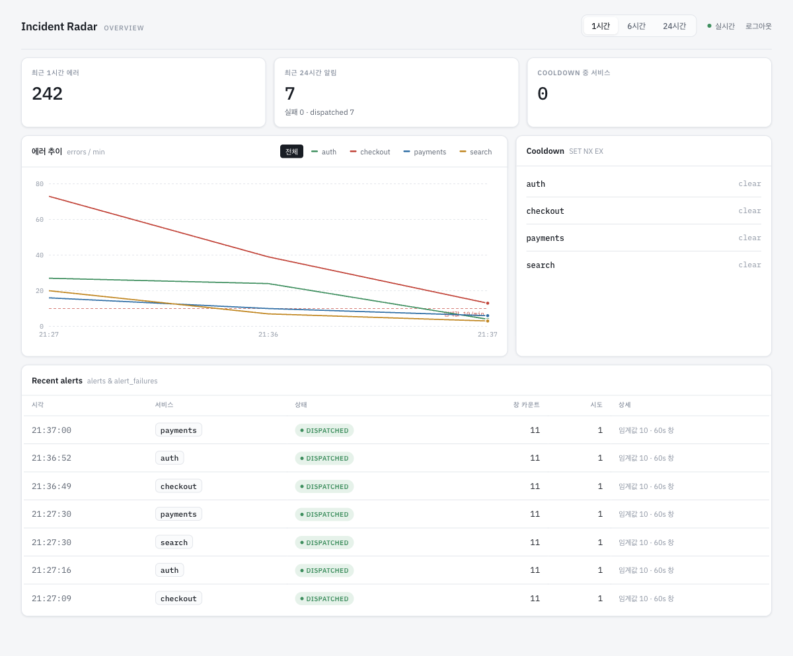
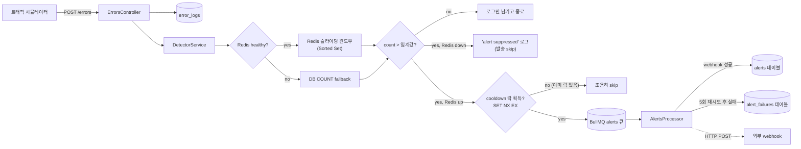

# Incident Radar

실시간 에러 모니터링·알림 서비스. 여러 앱이 에러를 보고하면(`POST /errors`) 서비스별
최근 60초 에러 수를 세다가 임계값을 넘으면 webhook으로 알림을 발송한다. 중복 알림은
cooldown으로 억제하고, 발송 실패는 지수 백오프로 재시도한다. Redis가 죽어도 감지는
DB로 계속되고(알림 발송만 일시 정지), 대시보드로 실시간 상태를 볼 수 있다.

대시보드 — 서비스별 에러 추이, 활성 cooldown, 최근 알림(성공·실패 병합). 로그인 뒤에 있다.



## 스택

| 영역 | 기술 | 선택 이유 |
| --- | --- | --- |
| Monorepo | pnpm workspace · Turborepo | 백엔드·프론트·공유 패키지를 한 저장소에서 관리 |
| Backend | NestJS | 에러 수집·감지·알림·조회를 모듈 단위로 분리 |
| Database | PostgreSQL · TypeORM | 에러 이벤트와 알림 이력의 영속 저장 |
| Realtime / Cache | Redis · ioredis | 슬라이딩 윈도우 집계 + cooldown 상태 관리 |
| Queue | BullMQ | 에러 수집과 webhook 알림을 비동기로 분리 |
| Validation | Zod | API 경계의 런타임 검증 + 백엔드/프론트 스키마 공유 |
| Auth | express-session · connect-redis · bcrypt | 대시보드 로그인 세션(Redis 저장) + 수집 API 키 |
| Frontend | Next.js · Tailwind CSS | 설정 최소화로 대시보드 UI 구성 |
| Server State | TanStack Query | API 캐싱 + 5초 폴링 |
| UI State | Zustand | 서버 데이터와 화면 상태 분리 |
| Chart | Recharts | 에러 추이 데이터 시각화 |
| Logging | nestjs-pino | dev는 사람이 읽기 좋게, prod는 구조화 JSON |
| Docs | @nestjs/swagger + zod-to-openapi | 실제 검증 스키마에서 API 문서 파생 |

## 아키텍처



대시보드(`GET /stats`·`/status`·`/alerts`)는 이 파이프라인이 쓴 데이터를 읽기 전용으로
다시 모양내는 별도 계층이다 — 원장 조회(`GET /errors`)와 분리해 각 패널이 필요한
형태로만 응답한다.

## 설계 근거

**슬라이딩 윈도우(Sorted Set) vs 고정 윈도우(INCR+EXPIRE)** — 고정 윈도우는 구현이
간단하지만 윈도우 경계에 걸친 버스트를 임계값의 최대 2배까지 놓칠 수 있다(예: 59초에
9건, 61초에 9건이면 어느 60초 구간을 봐도 임계값 10건을 안 넘지만 실제로는 2초 사이
18건이 몰린 것). Sorted Set에 타임스탬프를 점수로 넣고 매 요청마다 오래된 항목을
제거한 뒤 세면 항상 "최근 60초" 그대로를 본다. 카운터는 인터페이스 뒤에 있어 Redis
다운 시 DB COUNT 구현으로 교체된다 — 투기적 추상화가 아니라 fallback 경로가 실제로
런타임에 두 번째 구현을 골라야 하므로 필요한 seam이다.

**BullMQ + 지수 백오프 + 실패 테이블 vs 인프로세스 재시도** — webhook 호출을 그 자리에서
`await`+`retry`로 처리하면 프로세스가 재시작될 때 진행 중이던 재시도가 그냥 사라진다.
BullMQ 큐에 넣으면 재시도 상태가 Redis에 영속돼 재시작에도 살아남고, 재시도 사이 대기도
이벤트 루프를 막지 않는다. 재시도는 최초 1회+재시도 4회(총 5회), 간격 1·2·4·8초(지수)에
지터로 대기시간을 0~20% 줄여 여러 잡이 같은 타이밍에 몰려 재시도하는 걸 피한다. 5회 다
실패하면 `alerts`와 별도로
`alert_failures` 테이블에 페이로드·에러·시도 횟수를 남긴다 — `alerts` 스키마를 널 허용
필드로 늘리는 대신 성공/실패를 테이블로 나눠서 "발송 실패만 전부 조회" 같은 질의가
간단해진다.

**Redis 다운 시 fail-open vs fail-close** — Redis가 죽었을 때 감지 자체를 멈추는 쪽
(fail-close)이 더 "안전해" 보이지만, 알림 시스템에서는 그게 더 나쁘다 — 실제로 장애가
난 서비스가 있어도 아무도 못 알게 된다. 그래서 이 프로젝트는 fail-open을 택한다:
카운팅은 DB COUNT로 계속하고(감지는 살아있음), cooldown·BullMQ 발송만 건너뛴다(Redis가
필요한 부분이라 어쩔 수 없음). 5초마다 Redis를 프로브해서 복구되면 자동으로 되돌아간다.
이 규모에서는 healthy 불린 플래그로 충분하고, 풀 서킷 브레이커는 과하다.

**cooldown에 `SET key NX EX ttl`을 쓰는 이유** — "이미 cooldown 중인가"를 확인
(`GET`)하고 아니면 설정(`SET`)하는 두 단계로 나누면, 그 사이에 다른 요청이 끼어들어
둘 다 통과하는 레이스가 생긴다(임계값을 넘는 요청은 짧은 시간에 몰려서 오므로 실제로
자주 벌어진다). `SET NX EX`는 "키가 없으면 설정하고 성공, 있으면 아무것도 안 하고
실패"를 원자적으로 처리해 이 레이스를 없앤다. `EX`로 TTL을 같이 주면 별도 정리 없이
cooldown이 스스로 만료된다.

**대시보드 인증에 서버 세션 vs JWT** — JWT는 무상태라 저장소가 필요 없지만, 한 번
발급하면 만료 전엔 서버가 취소하기 어렵다(로그아웃·강제 만료를 하려면 결국 무효화
목록을 Redis에 둬야 한다). 이 프로젝트는 이미 Redis가 있어서 서버 세션의 유일한
비용(공유 저장소)이 사실상 0이고, 대신 로그아웃이 즉시 반영되고 "이 유저 전 기기
로그아웃" 같은 것도 키 삭제로 끝난다. 그래서 `express-session` + `connect-redis`를
택했다. connect-redis v10은 node-redis 클라이언트만 받으므로(ioredis 비호환) 세션
전용 커넥션을 따로 연다 — 앱 캐시 I/O와 세션 I/O를 분리하는 편이기도 하다. 수집
엔드포인트(`POST /errors`)는 사람이 아니라 앱이 부르므로 세션이 아니라 API 키로
인증한다.

## 로컬 실행

### 풀스택 한 번에 (docker compose)

```bash
cp .env.example .env
# .env 에 SESSION_SECRET(16자+), SEED_ADMIN_EMAIL, SEED_ADMIN_PASSWORD 를 채운다

docker compose up --build -d          # postgres · redis · backend(:3000) · frontend(:3001)
# backend 로그에 "listening on :3000" 이 뜨면:
docker compose exec backend pnpm seed:admin   # 대시보드 로그인 계정
```

대시보드 <http://localhost:3001> 를 열고 `SEED_ADMIN_*` 계정으로 로그인. 컨테이너는
`NODE_ENV=production` 으로 뜨지만 `SESSION_COOKIE_SECURE=false`(compose 에 설정됨)라
http 로도 세션이 물린다.

### 개발 루프 (pnpm, watch 모드)

```bash
docker compose up -d postgres redis
cp .env.example .env
pnpm install
pnpm --filter backend migration:run
pnpm --filter backend seed:admin      # .env 의 SEED_ADMIN_* 필요

pnpm --filter backend dev             # :3000
pnpm --filter frontend dev            # :3001 (별도 터미널)

# 데모 트래픽 (선택) — POST /errors 는 API 키가 필요하다
export SIM_API_KEY=$(pnpm --filter backend --silent seed:api-key sim)
pnpm --filter @incident-radar/tools sim -- --spike checkout
```

## API

Swagger UI: `http://localhost:3000/docs` (JSON은 `/docs-json`). `apps/backend/api.http`에
VS Code REST Client / JetBrains용 요청 모음도 있다.

```bash
# 헬스체크 — DB 다운이면 503, Redis만 다운이면 200 degraded
curl http://localhost:3000/health

# 에러 보고 (API 키 필수 — pnpm --filter backend seed:api-key <이름> 으로 발급)
curl -X POST http://localhost:3000/errors \
  -H "content-type: application/json" \
  -H "authorization: Bearer $SIM_API_KEY" \
  -d '{"service":"checkout","message":"payment gateway timeout"}'

# 로그인 (세션 쿠키를 파일로 저장)
curl -c cookies.txt -X POST http://localhost:3000/auth/login \
  -H "content-type: application/json" \
  -d '{"email":"me@example.com","password":"..."}'

# 조회 라우트는 로그인 세션 필수 — 저장한 쿠키를 함께 보낸다
curl -b cookies.txt "http://localhost:3000/errors?service=checkout&limit=50"
curl -b cookies.txt "http://localhost:3000/stats?service=checkout&bucket=60"
curl -b cookies.txt http://localhost:3000/status
curl -b cookies.txt http://localhost:3000/alerts

# API 키 발급 (admin 로그인 필요, 평문 토큰은 이 응답에서만)
curl -b cookies.txt -X POST http://localhost:3000/api-keys \
  -H "content-type: application/json" -d '{"name":"ci-runner"}'
```

**인증 두 갈래.** 기계는 API 키로 쓰고, 사람은 로그인해서 읽는다.

- `POST /errors` (수집) → `Authorization: Bearer <API 키>`. 키는 admin 이
  `POST /api-keys` 또는 `pnpm --filter backend seed:api-key <이름>` 으로 발급하고,
  평문은 발급 시 1회만 노출된다(DB엔 sha256 해시). `RATE_LIMIT_PER_MIN`(기본 600) IP
  레이트리밋도 함께 걸린다 — 부하테스트는 이 값을 올린다.
- `GET /errors`·`/stats`·`/status`·`/alerts`·`/auth/me` (조회) → 로그인 세션 쿠키.
  `POST /auth/login` 이 세션을 만들고(Redis 저장), `/auth/logout` 이 즉시 무효화한다.
  로그인은 무차별 대입 방지로 분당 10회로 제한된다.
- `POST`·`GET`·`DELETE /api-keys` (키 관리) → admin 역할 세션만.

## 테스트

```bash
pnpm test        # 전체 워크스페이스 (백엔드는 docker-compose.test.yml 로 Postgres·Redis 자동 기동)
pnpm lint
pnpm typecheck
```
